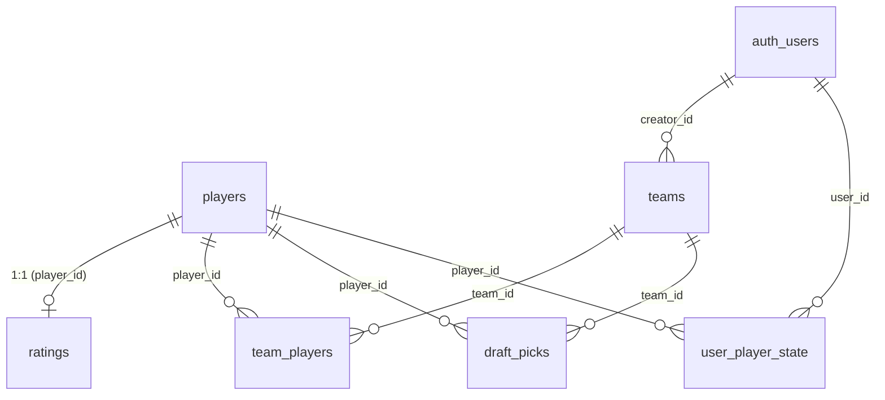

# Supabase-Schema (v1)

Konkrete Tabellenstruktur für die in `product-spec.md` beschriebenen Daten/Features, auf Basis der Entscheidungen
aus ADR 0001–0003. Das ausführbare DDL liegt in `supabase/schema.sql`.

## Grundprinzip

Zwei getrennte Verantwortungsbereiche, passend zu ADR 0001 (Pipeline vs. App entkoppelt):

- **Von der Pipeline geschrieben** (täglich, `pipeline/`): `players`, `ratings`, `pipeline_runs`. Kein Nutzer
  schreibt hier direkt — Public Read, Write nur über den Service-Role-Key der GitHub Action.
- **Von der App geschrieben** (Nutzer-Interaktion): `teams`, `team_players`, `draft_picks`, `user_player_state`.
  Row-Level-Security sorgt dafür, dass jeder Nutzer nur seine eigenen Zeilen sieht/ändert.

## Tabellen

### `players`
Stammdaten aus `CommonAllPlayers` + abgeleitete Fantasy-Positionen (siehe product-spec 2.6). Ändert sich selten
(Trades, Rookies) — eigene Tabelle statt in `ratings` gemischt, damit der tägliche Pipeline-Lauf normalerweise nur
`ratings` anfasst.

`fantasy_positions` als Postgres-`text[]` (z. B. `{PG,SG}`) statt eigener Join-Tabelle: Positionen werden immer
zusammen mit dem Spieler gelesen, nie unabhängig abgefragt — ein Array spart einen Join, den wir nirgends brauchen.

### `ratings`
Nur die **9 rohen Kategorie-Ratings** (0–100 skaliert) + `availability_score`, plus die **Basis**-Overall-/
Performance-/Combined-Ratings (kein Punt). Punt-Varianten werden NICHT gespeichert (ADR 0002) — die Basis-Ratings
speichern wir trotzdem, weil die Pipeline sie ohnehin berechnen muss, um die Top-~200-Spieler auszuwählen, und ein
direkt abfragbares `total_rating` einen `ORDER BY` in SQL erlaubt, statt dass der Client für die Standard-Sortierung
zwingend alle 9 Rohwerte erst clientseitig aufsummieren müsste.

`season` als eigene Spalte (statt hart im Tabellennamen), damit ein Saisonwechsel keine Schema-Änderung braucht.

### `pipeline_runs`
Append-only Log statt Einzelzeile: jeder tägliche Lauf trägt eine Zeile ein. Ersetzt den v1-Hack, das
"zuletzt aktualisiert"-Datum aus dem Dateisystem-mtime einer CSV abzulesen (`get_data_last_updated()` in
`views.py`). Frontend fragt einfach `ORDER BY run_at DESC LIMIT 1`.

### `teams`
Entspricht v1s `Team`-Model, `creator_id` verweist auf `auth.users` (Supabase Auth) statt Djangos `User`.

**Verbesserung gegenüber v1:** "genau ein aktives Team pro Nutzer" war in v1 nur durch Anwendungslogik in
`activate_team()` sichergestellt (erst alle deaktivieren, dann eins aktivieren — bei einem Absturz dazwischen
inkonsistent möglich). In Postgres erzwingen wir das direkt über einen **partiellen Unique Index**
(`UNIQUE (creator_id) WHERE is_active`) — die Datenbank garantiert die Invariante, nicht nur der Code.

### `team_players`
Entspricht v1s `TeamPlayer`. Status-Werte identisch (`ON_TEAM`/`AVAILABLE`/`UNAVAILABLE`).

### `draft_picks`
Entspricht v1s `DraftPick`. **Verbesserung gegenüber v1:** Der `UNIQUE (team_id, pick_number)`-Constraint zwang
v1 beim Verschieben eines Picks zu einem umständlichen 3-Schritt-Tausch über eine Platzhalter-Pick-Nummer 0
(`move_draft_pick()` in `views.py`), um die Unique-Verletzung zwischenzeitlich zu vermeiden. Mit
`DEFERRABLE INITIALLY DEFERRED` auf dem Constraint wird die Prüfung erst am Transaktionsende ausgeführt — der
Tausch kann in einem einzigen `UPDATE` passieren, kein Placeholder-Hack mehr nötig.

### `user_player_state` **[NEU/v2]**
In v1 lebten Highlight- und Verletzt-Markierungen nur in der Django-Session (weg bei Cookie-Löschung, nicht
geräteübergreifend — siehe product-spec 3.2). Hier persistiert pro `(user_id, player_id)`.

**Bewusst NICHT hier:** die "2 Spieler vergleichen"-Auswahl. Das ist eine flüchtige UI-Aktion für die aktuelle
Sitzung, kein dauerhafter Marker wie Highlight/Verletzt — bleibt reiner Client-State (z. B. React-State oder
`localStorage`), keine eigene Tabelle nötig.

## Row-Level-Security (Kurzfassung, Details im SQL)

- `players`, `ratings`, `pipeline_runs`: `SELECT` für alle (auch anonym), `INSERT/UPDATE` nur für den
  Service-Role-Key (Pipeline).
- `teams`, `team_players`, `draft_picks`, `user_player_state`: Nutzer sieht/ändert ausschließlich Zeilen, bei denen
  `auth.uid()` mit `creator_id`/`user_id` bzw. (für `team_players`/`draft_picks`) mit dem `creator_id` des
  referenzierten Teams übereinstimmt.
